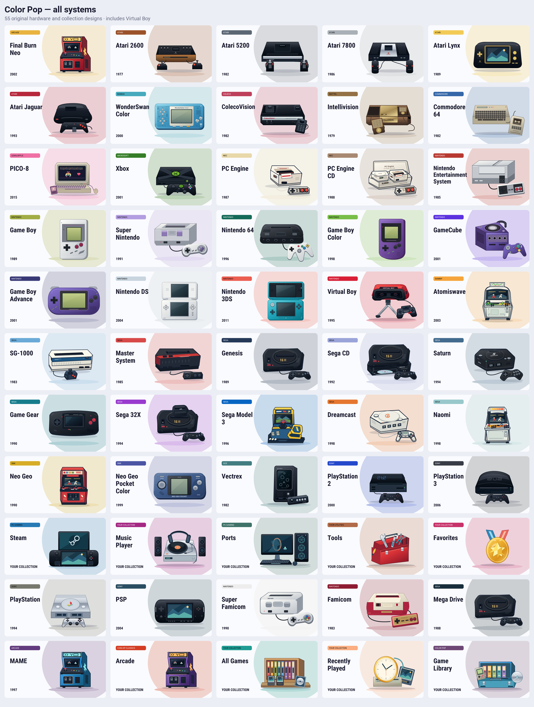

# Multi Pop Thor

A dual-screen theme for AYN Thor running ROCKNIX EmulationStation. The current theme is called **Color Pop** in EmulationStation; its folder and runtime identifier remain `color-pop-thor`. `multi-pop-thor` is the source repository name.

The upper display shows a system's original hardware illustration while browsing systems. Select a system and it becomes a gameplay preview with the game's title, genre, publisher, year, and description. A screenshot appears first, then an available video begins after three seconds with audio off. The lower display keeps a three-cover carousel for browsing. Missing details stay blank and missing artwork uses a labeled system card.

## Artwork

The 55 artwork entries include Saturn, PC Engine CD, Sega CD, Virtual Boy, regional variants, arcade platforms, and collections. Each has a distinct palette and matching upper artwork and lower card. These illustrations were created specifically for this theme; the editable SVGs are in [`color-pop-thor/assets/systems`](color-pop-thor/assets/systems/), and the card and hero PNGs are generated from them.

## Controls and compatibility

A selects or plays, B goes back, and L1/R1 page three games left/right in the game browser. Paging stops at the ends and keeps the current system selected. The patched frontend also sizes the B navigation popup and savestate manager for the upper display.

The tested setup is ROCKNIX 20261001 on AYN Thor, with a 1920×1080 upper display, a 1240×1080 lower display, and a 4400×1080 frontend canvas. It uses a hidden 1240-pixel margin to place menus correctly. This theme targets ROCKNIX EmulationStation; other firmware and ES-DE on Android need separate validation.

## Installation

The installable theme folder is [`color-pop-thor`](color-pop-thor/). Copy it to the Thor's themes directory and follow the [activation and restore instructions](color-pop-thor/README.md). The layout helpers preserve original settings and Sway configuration for restoration.

**This is a source checkout.** The compiled frontend used on the tested Thor is excluded as a local build artifact. Full paging and popup behavior require a compatible locally built frontend at `color-pop-thor/frontend/emulationstation`; the launcher falls back to the system frontend when it is absent. Public patches and notices are included, with [native build notes](frontend-build/README.md).

## Working on the theme

- `color-pop-thor/layouts/` and `theme.xml` define the two-screen layout.
- `color-pop-thor/assets/systems/` contains the editable hardware drawings; `assets/cards/`, `assets/heroes/`, `palettes/`, and `platforms.json` contain generated artwork and metadata.
- `tools/build-color-pop-art.py` rebuilds cards, heroes, palettes, and platform metadata. It needs Python with Pillow and Node.js with Sharp. It uses `node` and `require("sharp")` by default; `MULTIPOP_NODE` and `MULTIPOP_SHARP` can point to an existing runtime. Dependencies are not yet locked for distribution.
- `tools/check-color-pop.py` checks XML/SVG parsing, asset references, visible screen bounds, distinct palettes, contrast, and shell syntax. Run `python3 tools/check-color-pop.py` from this repository.
- `tools/install-color-pop-theme.py` updates an already activated Thor from a complete archive with a verified compatible frontend. Media fetch, packaging, and installation tools use separate inventories and staging data; no library or downloaded game media is included here. See [the media tooling notes](docs/media-tools.md).

## Credits and source status

The visual direction is inspired by [Colorful (Simplified)](https://github.com/anthonycaccese/colorful-simplified-es-de). Screen mapping follows the [DII-ESS-AYE Thor layout](https://github.com/beebono/dii-ess-aye); its graphics, sounds, and fonts are not included.

Roboto and Roboto Condensed are unmodified third-party fonts, with their Apache 2.0 [license and notice](color-pop-thor/assets/fonts/). The optional native frontend derives from [ROCKNIX EmulationStation](https://github.com/ROCKNIX/emulationstation) and retains [third-party notices](color-pop-thor/frontend/licenses/). The launcher and activation helpers retain GPL-2.0-or-later headers.

Game covers, screenshots, descriptions, and videos are separate third-party media. The device's fetched media used Libretro thumbnails, LaunchBox metadata, and credited World of Longplays excerpts; it is not part of the original system illustrations or this source repository.

This repository captures the working theme for further development. A project-wide license, reproducible release packaging, and compatibility beyond the tested firmware remain to be settled before a public release. No compiled frontend, service credentials, ROMs, device configuration, or game library is included.
